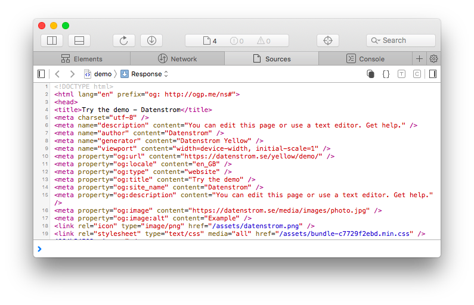

<a href="README-de.md">Deutsch</a> &nbsp; <a href="README.md">English</a> &nbsp; <a href="README-sv.md">Svenska</a>

# Meta 0.9.2

Metadata för människor och maskiner.

## Hur man installerar ett tillägg

[Ladda ner ZIP-filen](https://github.com/annaesvensson/yellow-meta/archive/refs/heads/main.zip) och kopiera den till din `system/extensions` mapp. [Läs mer om tillägg](https://github.com/annaesvensson/yellow-update/tree/main/README-sv.md).

## Hur man lägger till metadata

Den här tillägget genererar metadata för [Open Graph protocol](https://ogp.me/).

Du kan ställa in `Title`, `Description`, `Image` och `ImageAlt` i [sidinställningar](https://github.com/annaesvensson/yellow-core/tree/main/README-sv.md#inställningar-page) högst upp på en sida. Du kan konfigurera ytterligare metadata i HTML-headern, till exempel i filen  `system/layouts/header.html`.

## Exempel

Innehållsfil med metadata: 

    ---
    Title: Exempelsida
    Description: Exempel för din webbplats
    Image: photo.jpg
    ---
    Lorem ipsum dolor sit amet, consectetur adipisicing elit, sed do eiusmod tempor incididunt ut 
    labore et dolore magna pizza. Ut enim ad minim veniam, quis nostrud exercitation ullamco laboris 
    nisi ut aliquip ex ea commodo consequat. Duis aute irure dolor in reprehenderit in voluptate velit 
    esse cillum dolore eu fugiat nulla pariatur. Excepteur sint occaecat cupidatat non proident, sunt 
    in culpa qui officia deserunt mollit anim id est laborum.

Innehållsfil med metadata från första bilden:

    ---
    Title: Exempelsida
    Description: Exempel för din webbplats
    ---
    [image photo.jpg]

    Lorem ipsum dolor sit amet, consectetur adipisicing elit, sed do eiusmod tempor incididunt ut 
    labore et dolore magna pizza. Ut enim ad minim veniam, quis nostrud exercitation ullamco laboris 
    nisi ut aliquip ex ea commodo consequat. Duis aute irure dolor in reprehenderit in voluptate velit 
    esse cillum dolore eu fugiat nulla pariatur. Excepteur sint occaecat cupidatat non proident, sunt 
    in culpa qui officia deserunt mollit anim id est laborum.

Layoutfil med ytterligare metadata för sökmotorer:

    <!DOCTYPE html>
    <html lang="<?php echo $this->yellow->page->getHtml("language") ?>">
    <head>
    <title><?php echo $this->yellow->page->getHtml("titleHeader") ?></title>
    <meta charset="utf-8" />
    <meta name="description" content="<?php echo $this->yellow->page->getHtml("description") ?>" />
    <meta name="author" content="<?php echo $this->yellow->page->getHtml("author") ?>" />
    <meta name="generator" content="Datenstrom Yellow" />
    <meta name="viewport" content="width=device-width, initial-scale=1" />
    <meta name="robots" content="index, follow" />
    <?php echo $this->yellow->page->getExtraHtml("header") ?>
    </head>
    ...

Layoutfil med ytterligare metadata för Mastodon:

    <!DOCTYPE html>
    <html lang="<?php echo $this->yellow->page->getHtml("language") ?>">
    <head>
    <title><?php echo $this->yellow->page->getHtml("titleHeader") ?></title>
    <meta charset="utf-8" />
    <meta name="description" content="<?php echo $this->yellow->page->getHtml("description") ?>" />
    <meta name="author" content="<?php echo $this->yellow->page->getHtml("author") ?>" />
    <meta name="generator" content="Datenstrom Yellow" />
    <meta name="viewport" content="width=device-width, initial-scale=1" />
    <link rel="me" href="https://mastodon.social/@datenstrom" />
    <?php echo $this->yellow->page->getExtraHtml("header") ?>
    </head>
    ...

## Inställningar

Följande inställningar kan konfigureras i filen `system/extensions/yellow-system.ini`:

`MetaDefaultImage` = sidans bild, `favicon` för att använda webbplatsens standardikon  

Följande filer kan anpassas:

`system/layouts/header.html` = layoutfil för standard HTML-header  

## Tack

Detta tillägg underhålls tidigare av Steffen Schultz. Tack för ett bra jobb.

## Utvecklare

Anna Svensson. [Få hjälp](https://datenstrom.se/sv/yellow/help/).
